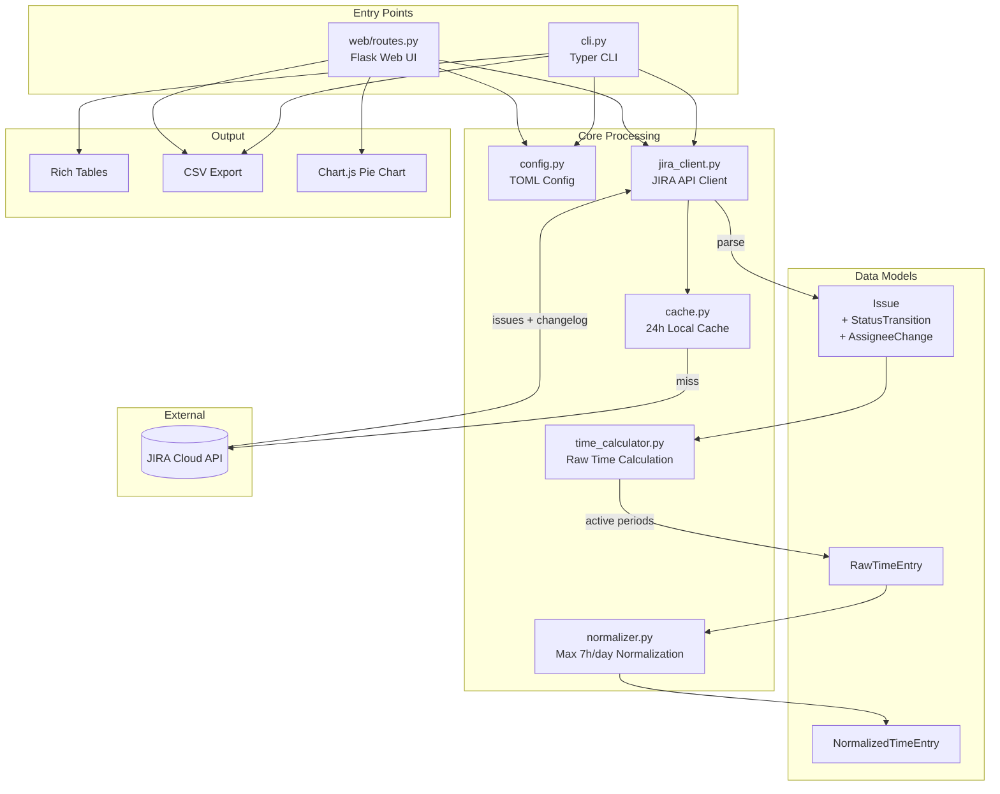
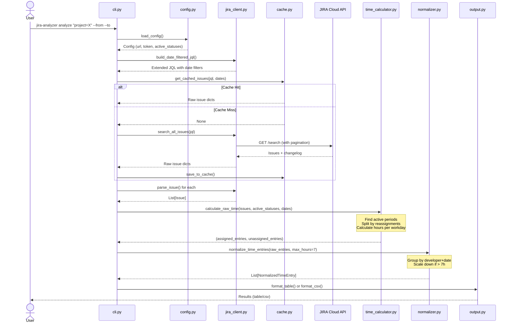

# Architecture

## Component Overview

```mermaid
flowchart TB
    subgraph Entry["Entry Points"]
        CLI["cli.py<br/>Typer CLI"]
        WEB["web/routes.py<br/>Flask Web UI"]
    end

    subgraph Core["Core Processing"]
        CONFIG["config.py<br/>TOML Config"]
        CLIENT["jira_client.py<br/>JIRA API Client"]
        CACHE["cache.py<br/>24h Local Cache"]
        CALC["time_calculator.py<br/>Raw Time Calculation"]
        NORM["normalizer.py<br/>Max 7h/day Normalization"]
    end

    subgraph Models["Data Models"]
        ISSUE["Issue<br/>+ StatusTransition<br/>+ AssigneeChange"]
        RAW["RawTimeEntry"]
        NORMALIZED["NormalizedTimeEntry"]
    end

    subgraph Output["Output"]
        TABLE["Rich Tables"]
        CSV["CSV Export"]
        CHART["Chart.js Pie Chart"]
    end

    subgraph External["External"]
        JIRA[("JIRA Cloud API")]
    end

    CLI --> CONFIG
    WEB --> CONFIG
    CLI --> CLIENT
    WEB --> CLIENT

    CLIENT --> CACHE
    CACHE -->|miss| JIRA
    JIRA -->|issues + changelog| CLIENT
    CLIENT -->|parse| ISSUE

    ISSUE --> CALC
    CALC -->|active periods| RAW
    RAW --> NORM
    NORM --> NORMALIZED

    CLI --> TABLE
    CLI --> CSV
    WEB --> CHART
    WEB --> CSV
```

## Request Flow

```mermaid
sequenceDiagram
    actor User
    participant CLI as cli.py
    participant Config as config.py
    participant Client as jira_client.py
    participant Cache as cache.py
    participant JIRA as JIRA Cloud API
    participant Calc as time_calculator.py
    participant Norm as normalizer.py
    participant Output as output.py

    User->>CLI: jira-analyzer analyze "project=X" --from --to
    CLI->>Config: load_config()
    Config-->>CLI: Config (url, token, active_statuses)

    CLI->>Client: build_date_filtered_jql()
    Client-->>CLI: Extended JQL with date filters

    CLI->>Cache: get_cached_issues(jql, dates)

    alt Cache Hit
        Cache-->>CLI: Raw issue dicts
    else Cache Miss
        Cache-->>CLI: None
        CLI->>Client: search_all_issues(jql)
        Client->>JIRA: GET /search (with pagination)
        JIRA-->>Client: Issues + changelog
        Client-->>CLI: Raw issue dicts
        CLI->>Cache: save_to_cache()
    end

    CLI->>Client: parse_issue() for each
    Client-->>CLI: List[Issue]

    CLI->>Calc: calculate_raw_time(issues, active_statuses, dates)
    Note over Calc: Find active periods<br/>Split by reassignments<br/>Calculate hours per workday
    Calc-->>CLI: (assigned_entries, unassigned_entries)

    CLI->>Norm: normalize_time_entries(raw_entries, max_hours=7)
    Note over Norm: Group by developer+date<br/>Scale down if > 7h
    Norm-->>CLI: List[NormalizedTimeEntry]

    CLI->>Output: format_table() or format_csv()
    Output-->>User: Results (table/csv)
```

The web interface follows the same core path, with `routes.py` → `analysis.py` instead of `cli.py`.
